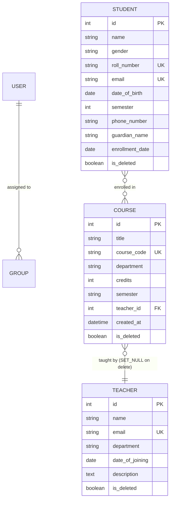

# 🎓 Student Management System (SMS) - Django REST API

[](https://www.djangoproject.com/)
[](https://www.django-rest-framework.org/)
[](https://django-rest-framework-simplejwt.readthedocs.io/)
[](https://drf-spectacular.readthedocs.io/)

A modern, robust, and fully-featured **Student Management System (SMS)** built with **Django** and **Django REST Framework (DRF)**. This system features granular **Role-Based Access Control (RBAC)**, stateful JSON Web Token (JWT) authentication, soft deletion across all major entities, advanced search/filtering capabilities, and fully-interactive autogenerated API documentation.

---

## 🌟 Key Features

*   **🔒 Secure JWT Authentication**: Robust, stateless authentication using `djangorestframework-simplejwt` with secure login (`/api/token/`), automatic token refreshing (`/api/token/refresh/`), and blacklist-based logout (`/api/logout/`).
*   **👥 Role-Based Access Control (RBAC)**: Fine-grained permissions based on Django Groups (`Admin`, `Teacher`, `Student`):
    *   **Admin**: Unrestricted read/write/delete privileges across all models and role assignment.
    *   **Teacher**: Full read access to students, teachers, and courses; unauthorized to perform mutations.
    *   **Student**: Accesses restricted views with limited data exposure via a dedicated serializer (safeguarding sensitive information).
*   **🛡️ Soft Delete Protection**: Database records for Students, Teachers, and Courses are never permanently deleted from the database. Instead, they utilize an `is_deleted` flag. Views automatically filter out soft-deleted records.
*   **📂 Structured Models & Relationships**:
    *   *Student*: Many-to-Many relationship with `Course`.
    *   *Course*: Foreign Key relationship with `Teacher` (using `on_delete=models.SET_NULL` to prevent cascading deletions).
*   **🔍 Search & Filtering**: Built-in search and query filters using `django-filter` to quickly fetch teachers, courses, or students by department, name, joining date, etc.
*   **📖 Interactive Swagger & Redoc**: Standardized OpenAPI 3.0 schema generation using `drf-spectacular`, serving dynamic API playgrounds at `/api/docs/` and clean documentation at `/api/redoc/`.
*   **🎨 Simple Frontend Client**: Contains an HTML frontend integration at `/add-teacher/` demonstrating CSRF token passing and API interaction.

---

## 🏗️ Architecture & Database Relationships

The system employs a modular architecture with individual apps managing core system entities:



---

## 🛠️ Tech Stack

*   **Backend Framework**: Django 5.2.12
*   **API Toolkit**: Django REST Framework (DRF) 3.17.1
*   **Authentication**: SimpleJWT 5.5.1 (JSON Web Tokens)
*   **API Spec/Documentation**: drf-spectacular 0.29.0 (OpenAPI 3.0, Swagger UI, Redoc)
*   **Filtering**: django-filter 25.2
*   **Database**: SQLite (default, easily switchable to PostgreSQL/MySQL)

---

## 🔑 Role & Serializer Permissions Matrix

| Entity | Role / Group | Permitted HTTP Methods | Serializer Used | Info Disclosed |
| :--- | :--- | :--- | :--- | :--- |
| **Student** | Admin | `GET`, `POST`, `PUT`, `PATCH`, `DELETE` | `StudentSerializer` | Full student profile & course info |
| | Teacher | `GET` (List & Detail) | `StudentSerializer` | Full student profile & course info |
| | Student | `GET` (List & Detail) | `StudentRestrictedSerializer` | Limited (ID, Name, Gender, Semester, Courses) |
| **Teacher** | Admin | `GET`, `POST`, `PUT`, `PATCH`, `DELETE` | `TeacherSerializer` | Full teacher profile details |
| | Teacher | `GET` | `TeacherSerializer` | Full teacher profile details |
| | Student | `GET` | `TeacherSerializer` | Full teacher profile details |
| **Course** | Admin | `GET`, `POST`, `PUT`, `PATCH`, `DELETE` | `CourseSerializer` | Full details, credits, and teacher |
| | Authenticated | `GET` | `CourseSerializer` | Full details, credits, and teacher |
| | Unauthenticated| `GET` | `CourseSummarySerializer`| Limited (Title, Department, Teacher Summary) |

---

## 📡 API Endpoints Reference

### 🔐 Authentication & Accounts

| Endpoint | Method | Permission | Description |
| :--- | :--- | :--- | :--- |
| `/api/register/` | `POST` | Open / Admin* | Create a new user account. *Admins can assign `Teacher`/`Admin` roles. |
| `/api/token/` | `POST` | AllowAny | Authenticate credentials and receive Access & Refresh JWTs. |
| `/api/token/refresh/`| `POST` | AllowAny | Submit a valid Refresh Token to obtain a new Access Token. |
| `/api/logout/` | `POST` | IsAuthenticated | Log out the user and blacklist their Refresh Token. |

### 🎓 Academic & Profiles (CRUD)

| Endpoint | Method | Permission | Description |
| :--- | :--- | :--- | :--- |
| `/api/students/` | `GET` | Authenticated | List all active (non-deleted) students (Serializer varies by role). |
| `/api/students/` | `POST` | Admin | Register/Create a student profile. |
| `/api/students/{id}/`| `GET`/`PUT`/`PATCH` | Role-based | View details or update student profile details. |
| `/api/students/{id}/`| `DELETE` | Admin | Soft delete the student record (`is_deleted=True`). |
| `/api/teachers/` | `GET` | Authenticated | List/search all active teachers (supports `search` query parameter). |
| `/api/teachers/` | `POST` | Admin | Create a teacher profile. |
| `/api/teachers/{id}/`| `GET`/`PUT`/`PATCH`| Role-based | View details or update teacher profile details. |
| `/api/teachers/{id}/`| `DELETE` | Admin | Soft delete the teacher record (`is_deleted=True`). |
| `/api/courses/` | `GET` | AllowAny | List courses (Detailed for authenticated; Summary for anonymous). |
| `/api/courses/` | `POST` | Admin | Create a course. |
| `/api/courses/{id}/` | `DELETE` | Admin | Soft delete the course record (`is_deleted=True`). |

### 📖 API Documentation

| Endpoint | Method | Description |
| :--- | :--- | :--- |
| `/api/schema/` | `GET` | Downloads/views the raw OpenAPI 3.0 JSON schema. |
| `/api/docs/` | `GET` | Fully interactive Swagger UI playground to run and test API endpoints. |
| `/api/redoc/` | `GET` | Redoc visual interface—ideal for clean, nested, read-only schema viewing. |

---

## ⚡ Quick Start & Installation

### 1. Clone & Set Up Directory
Ensure you are in the project root:
```bash
git clone <repository-url>
cd "Student Management System"
```

### 2. Activate Virtual Environment
A pre-configured virtual environment `.venv` is included. Activate it:
*   **Windows (PowerShell)**:
    ```powershell
    .venv\Scripts\Activate.ps1
    ```
*   **Windows (Command Prompt)**:
    ```cmd
    .venv\Scripts\activate.bat
    ```
*   **macOS / Linux**:
    ```bash
    source .venv/bin/activate
    ```

### 3. Install Dependencies
Install all required packages:
```bash
pip install -r requirement.txt
```

### 4. Run Database Migrations
Initialize the SQLite database (`db.sqlite3`):
```bash
python manage.py migrate
```

### 5. Create Superuser (Admin Account)
To log in as an administrator and manage teachers/students/courses:
```bash
python manage.py createsuperuser
```
Follow the prompt to set up a username, email, and password.

### 6. Run the Development Server
Start Django's built-in development web server:
```bash
python manage.py runserver
```
The server will start running at `http://127.0.0.1:8000/`.

---

## 🧪 Testing & API Interaction Guide

### Interactive Swagger UI
Open your browser and navigate to:
👉 **[http://127.0.0.1:8000/api/docs/](http://127.0.0.1:8000/api/docs/)**

From here, you can click **"Authorize"**, input your Bearer token, and test out all CRUD routes directly in your browser.

### Creating Roles (Django Admin Panel)
For RBAC custom permissions to function correctly:
1. Log in to the Django Admin at `http://127.0.0.1:8000/admin/`.
2. Under **Authentication and Authorization**, create three groups: `Admin`, `Teacher`, and `Student`.
3. Create standard users and assign them to their respective groups.
4. Enjoy role-restricted JSON structures!

### Soft Delete verification
When an Admin calls `DELETE /api/students/{id}/`, notice that the server responds with a `204 No Content`. If you inspect the database, the record is not removed; instead, `is_deleted = True` is updated. A subsequent `GET /api/students/` request will no longer return the deleted student.
